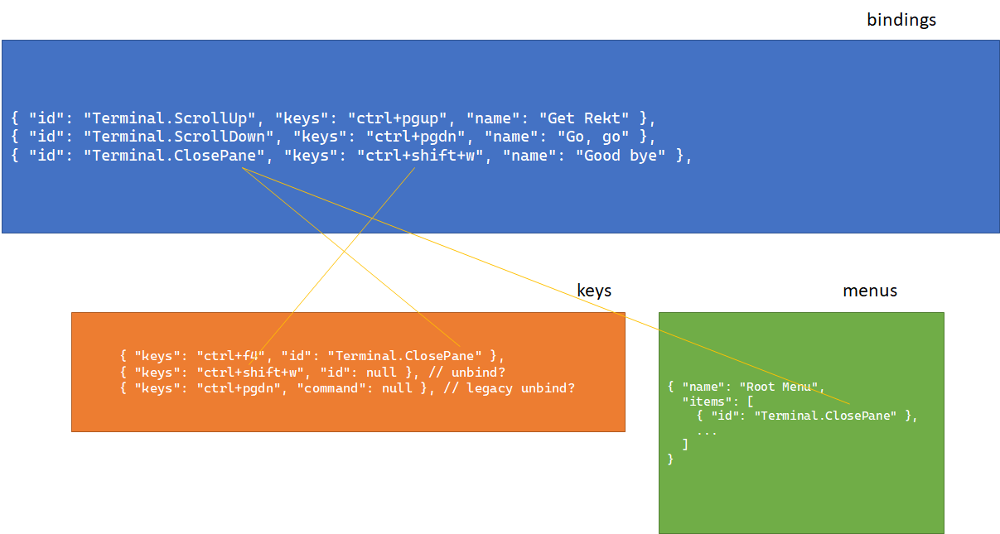
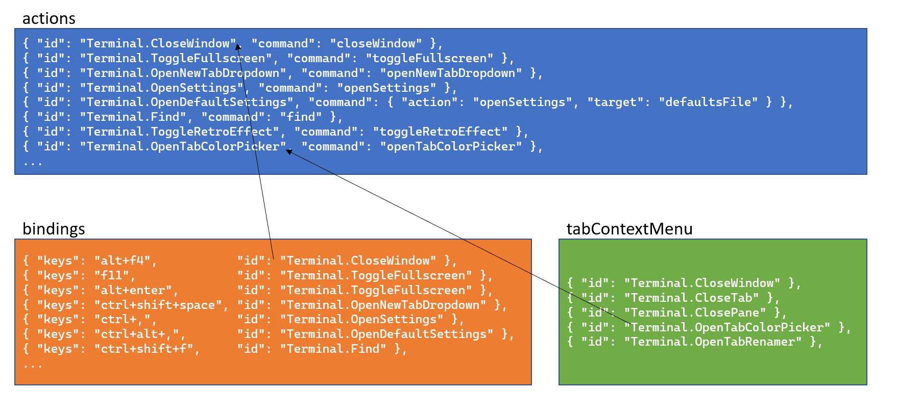

# Action IDs

## Abstract

This document is intended to serve as an addition to the [Command Palette Spec],
as well as the [New Tab Menu Customization Spec].

As we come to rely more on actions being a mechanism by which the user defines
"do something in the Terminal", we'll want to make it even easier for users to
re-use the actions that they've already defined, as to reduce duplicated json as
much as possible. This spec proposes a mechanism by which actions could be
uniquely identifiable, so that the user could refer to bindings in other
contexts without needing to replicate an entire json blob.

## Solution Design

This spec was largely inspired by the following diagram from @DHowett:



The goal is to introduce an `id` parameter by which actions could be uniquely
refered to. We'd maintain a large list of default actions, each with unique
`id`s set. The default bindings then would also point to actions defined in that
default actions list, through their set `id`. Furthermore, as we add additional
menus to the Terminal, like the customization for the new tab dropdown, or the
tab context menu, or the `TermControl` context menu, they could all refer to
these actions by `id`, rather than duplicating the same json.

A cleaner version of the above mockup might look like:


We'll first parse `actions` into a map of `id->Action`s. These ids must be
unique. When layering `actions`, if a later settings file contains an action
with the same `id`, it will replace the current value. In this way, users can
redefine actions, or remove default ones (with something like `{ "id":
"Terminal.OpenTab", "command":null }`

> 👉 NOTE: The IDs for the default actions will need to be manually created, not
> autogenerated. Every action in the default `bindings` should probably be given
> an `id` and defined in `actions`.

### Existing Scenarios

When parsing `bindings`, we'll check for the presence of an `id` key. If that's
found, we'll use the action with that global ID as the action for this binding.
If there's no `id` set, then we'll continue parsing as we always have. The user
doesn't _need_ to define any actions in `actions` - they could solely define
actions in the bindings.

**TODO**: When parsing a binding with both an `id` and a `command`, should we
use the action from the ID or the command? Both seem reasonable. e.g:

```json
"bindings":[
    { "command": { "action": "newTab", "profile": "foo" }, "id": "MyAction" }
]
```
Should we use the `MyAction` command, or the manually specified one?


Keybindings will still be stored as a `keys->Action` mapping, so the user will
still be able to override default keybindings exactly the same as before.

Similarly, commands in the Command Palette will continue using their existing
`name->Action` mapping they're currently using. For a binding like

```json
{ "keys": "ctrl+alt+x", "id": "Terminal.OpenDefaultSettings" },
```
* We'll bind whatever action is defined as `Terminal.OpenDefaultSettings` to
  <kbd>ctrl+alt+x</kbd>.
* We'll use whatever action is defined as `Terminal.OpenDefaultSettings` to
  generate a name for the command palette.

### Future Context Menus

In [New Tab Menu Customization Spec], we discuss allowing the user to bind
actions to the new tab menu. In that spec, they can do so with something like
the following:

```json
{
    "newTabMenu": [
        { "type":"action", "command": { "action": "adjustFontSize", "delta": 1 }, }
        { "type":"action", "command": { "action": "adjustFontSize", "delta": -1 }, }
        { "type":"action", "command": "resetFontSize", }
        { "type":"profile", "profile": "cmd" },
        { "type":"profile", "profile": "Windows PowerShell" },
        { "type":"separator" },
        {
            "type":"folder",
            "name": "Settings...",
            "icon": "C:\\path\\to\\icon.png",
            "entries":[
                { "type":"action", "command": "openSettings" },
                { "type":"action", "command": { "action": "openSettings", "target": "defaultsFile" } },
            ]
        }
    ]
}
```

In this example, the user has also exposed the "Increase font size", "Decrease
font size", and "Reset font size" actions, as well as the settings files in a
submenu. With this proposal, the above could instead be re-written as:

```json
{
    "newTabMenu": [
        { "type":"action", "id": "Terminal.IncreaseFontSize" },
        { "type":"action", "id": "Terminal.DecreaseFontSize" },
        { "type":"action", "id": "Terminal.ResetFontSize" },
        { "type":"profile", "profile": "cmd" },
        { "type":"profile", "profile": "Windows PowerShell" },
        { "type":"separator" },
        {
            "type":"folder",
            "name": "Settings...",
            "icon": "C:\\path\\to\\icon.png",
            "entries":[
                { "type":"action", "id": "Terminal.OpenDefaultSettings" },
                { "type":"action", "id": "Terminal.OpenSettings" },
            ]
        }
    ]
}
```

In this example, the actions are looked up from the global map using the `id`
provided, enabling the user to re-use their existing definitions. If the user
re-defined the `Terminal.IncreaseFontSize` action to mean something else, then
the action in the new tab menu will also be automatically updated.

Furthermore, when additional menus are added (such as the tab context menu, or
the `TermControl` context menu), these could also leverage a similar syntax to
the above to allow re-use of the `id` parameter.

## UI/UX Design

There's not a whole lot of UI for this feature specifically. This is largely
behind-the-scenes refactoring of how actions can be defined.

## Capabilities

### Accessibility

_(not applicable)_

### Security

_(no change expected)_

### Reliability

_(no change expected)_

### Compatibility

_(no change expected)_

### Performance, Power, and Efficiency

_(no change expected)_

## Potential Issues

This won't necessarily play well with iterable commands in the Command Palette,
but that's okay. For iterable commands, users will still need to define the
actions manually.

## Future considerations

* See the following issues for other places where this might be useful:
  - [#1912] - Context Menu for Tabs
    * See also [#5524], [#5025], [#5633]
  - [#3337] - Right-click menu inside TerminalControl (w/ Copy & Paste?)
    * See also [#5633] and [#5025], both those actions seem reasonable in either
      the tab context menu or the control context menu.

<!-- Footnotes -->
[Command Palette Spec]: https://github.com/microsoft/terminal/blob/master/doc/specs/%232046%20-%20Command%20Palette.md
[New Tab Menu Customization Spec]: https://github.com/microsoft/terminal/blob/master/doc/specs/%231571%20-%20New%20Tab%20Menu%20Customization.md

[#1571]: https://github.com/microsoft/terminal/issues/1571
[#1912]: https://github.com/microsoft/terminal/issues/1912
[#3337]: https://github.com/microsoft/terminal/issues/3337
[#5025]: https://github.com/microsoft/terminal/issues/5025
[#5524]: https://github.com/microsoft/terminal/issues/5524
[#5633]: https://github.com/microsoft/terminal/issues/5633
[#6899]: https://github.com/microsoft/terminal/issues/6899
